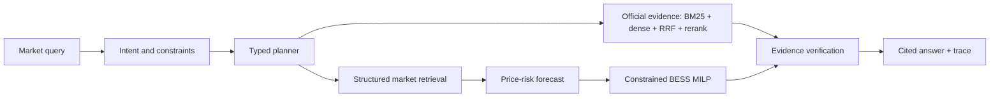

# Australian Energy Market Intelligence Agent

An evidence-first Agentic AI system for the Australian National Electricity Market (NEM): price-event detection, official-evidence retrieval, price-risk forecasting, constrained battery dispatch and auditable answers.

> **Current status (2026-08-20): engineering preflight.** The typed agent, API, deterministic planner, conformal seasonal baseline, constrained BESS MILP and synthetic fault fixtures are implemented and tested. A one-day official AEMO NEMWeb ingest is used only as a provenance/parser preflight. No 12-month real-market forecast, retrieval, Agent-evaluation, dispatch-backtest or cloud-deployment claim is made yet.

## System



The eight strict Pydantic tools are `get_market_snapshot`, `compare_region_period`, `detect_price_events`, `diagnose_price_event`, `search_official_evidence`, `forecast_price_risk`, `optimize_battery_dispatch`, and `explain_data_coverage`. User-supplied SQL, Elasticsearch DSL and optimisation expressions are rejected.

## Data provenance

- Market source: official [AEMO NEMWeb DispatchIS archive](https://nemweb.com.au/Reports/Archive/DispatchIS_Reports/), five-minute public dispatch reports.
- Explanatory source: official [AER wholesale performance reporting](https://www.aer.gov.au/industry/wholesale/performance).
- Every downloaded object must have URL, retrieval time, byte count and SHA-256 in a run manifest. Raw archives and large artifacts are gitignored.
- Synthetic data is confined to contract/fault tests and is labeled `synthetic-fixture-v1` in every response.

## Reproduce locally

```bash
python -m venv .venv
. .venv/bin/activate
pip install -e ".[test]"
pytest
ruff check .
mypy src
energy-agent fetch-dispatch-day 20260817 --output data/raw/PUBLIC_DISPATCHIS_20260817.zip
uvicorn energy_agent.api:app
```

API: `POST /api/agent/query`, `GET /api/agent/traces/{trace_id}`, `GET /api/tools`, `GET /metrics`.

## BESS and economic boundary

The standard battery is 1 MW / 2 MWh, 90% round-trip efficiency, 10–90% SoC, and 50% initial/terminal SoC. The MILP prevents simultaneous charge/discharge. Reported margin is only a **historical spot-market gross-margin proxy**. It excludes CAPEX, degradation, network fees, FCAS and any claim of investment return.

## Evaluation gates

The release gate requires a separately reported 100-task real-window set and failure fixtures: 100% schema validity and golden economic cases, at least 95% logical tool success and citation completeness, and at least 85% full-agent task success. Forecast, anomaly, retrieval and BESS experiments require rolling splits, baselines, ablations and uncertainty/stability reporting. Unmet gates remain visible; fixture metrics never become market-performance claims.

## Known errors and next evidence

- The generic DispatchIS parser is a preflight adapter and must be validated against the current AEMO MMS schema before full-year use.
- Dense retrieval, LightGBM quantiles/conformal calibration, rolling forecast MILP, threshold baseline, perfect-foresight oracle and real backtest reporting remain gated work.
- Model Studio is optional. With no credential, deterministic planning and all non-model paths remain testable; a large model is not self-hosted on the small cloud server.

## Attribution

The generalized typed-tool/state-machine pattern is a new personal portfolio extension derived from lessons in the author's housing Agent project. No Team 12 housing code, data, artifacts or team outcomes are included here. This repository is energy-specific work with independent schemas, market logic, forecasting, optimisation, tests and documentation.

## License

MIT for code in this repository. AEMO/AER data and reports retain their source terms; no third-party dataset is relicensed here.
