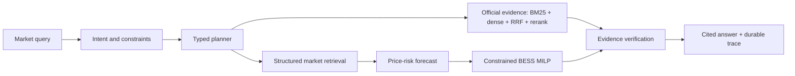

# Australian Energy Market Intelligence Agent

An evidence-first Agentic AI system for the Australian National Electricity Market (NEM): five-minute price-event detection, official-evidence retrieval, price-risk forecasting, constrained battery dispatch, historical value backtesting and auditable answers.

> **Verified release candidate — 20 August 2026.** The repository has a complete 12-month/five-region AEMO dataset, official AEMO/AER evidence index, rolling forecast and BESS experiments, a 100-task Agent evaluation, and an isolated Alibaba Cloud deployment. Model Studio was not configured, so the verified service uses deterministic typed planning; the constrained OpenAI-compatible adapter is tested offline but no live-model result or cost is claimed.

## System



The eight strict Pydantic tools are `get_market_snapshot`, `compare_region_period`, `detect_price_events`, `diagnose_price_event`, `search_official_evidence`, `forecast_price_risk`, `optimize_battery_dispatch`, and `explain_data_coverage`. User-supplied SQL, Elasticsearch DSL and optimisation expressions are rejected. The state machine performs normalization, bounded parallel calls, timeout/retry with backoff, loop detection, empty-result recovery, evidence/calculation verification and concise synthesis; complete tool outputs remain in the trace.

API: `POST /api/agent/query`, `GET /api/agent/traces/{trace_id}`, `GET /api/tools`, `GET /metrics`, and `GET /healthz`.

## Data and evidence provenance

- Market data: official [AEMO NEMWeb DispatchIS archive](https://nemweb.com.au/Reports/Archive/DispatchIS_Reports/), 18 August 2025–17 August 2026, 365 days × 288 intervals × five regions = **525,600 standard rows**.
- Fields: RRP, total demand, available generation, net interchange and intervention. The validated window contains no intervention rows.
- The daily archive for 10 March 2026 was incomplete (267 rather than 288 intervals per region). The pipeline failed closed, then replaced that day only from AEMO's official monthly MMSDM `DISPATCHPRICE` and `DISPATCHREGIONSUM` archives—no interpolation or synthetic fill.
- Final processed-data SHA-256: `7a82656c7571c28934407370155625bb64330e1d2b16dc68976dcdf5f1cf18dd`.
- Explanatory corpus: four AEMO Quarterly Energy Dynamics reports (Q3 2025–Q2 2026) and the AER January–March 2026 significant-price report; **735 chunks** with URL, publication/retrieval times, source hash, size, page count and usage boundary.
- Large artifacts and report text stay outside GitHub. Only compact, non-sensitive manifests and metrics are published under `artifacts/public/`; AEMO/AER source rights and terms remain with their publishers.

## Experiments

All forecast and dispatch results use chronological 70% train / 15% calibration / 15% test splits. No future labels enter features, calibration windows or operational schedules.

### Retrieval

On a 20-query curated official-source routing benchmark, BM25 reached MRR 0.892 and Recall@5 1.00; dense and RRF each reached MRR 0.950; hybrid+rerank reached **MRR 0.967, Recall@5 1.00**, with bootstrap MRR 95% interval 0.90–1.00. These labels test report routing, not passage-level factual correctness or open-domain QA.

### Forecast and anomaly stability

- Baselines: persistence and 24-hour seasonal; candidate: LightGBM L1 plus quantile models.
- LightGBM did **not** consistently beat persistence on MAE (it improved TAS1 and was nearly tied in VIC1), so no universal prediction-lift claim is made.
- Adaptive rolling 90% conformal coverage ranged from **88.64% to 91.52%** across regions; fixed calibration is retained as an ablation. Daily MAE bootstrap intervals are recorded per model and region.
- Anomaly reporting compares a fixed `RRP >= AUD 5,000/MWh` baseline with robust-z thresholds 4/5/6, Jaccard stability and day-level bootstrap event-rate intervals. There is no labelled anomaly ground truth, so counts are not presented as precision/recall.

### BESS backtest

The standard battery is 1 MW / 2 MWh, 90% round-trip efficiency, 10–90% SoC, and 50% initial/terminal SoC. The MILP prevents simultaneous charge/discharge. Both the MILP and threshold baseline receive the same leakage-free LightGBM price signal; actual prices are used only for settlement, while the oracle alone receives perfect foresight.

Across 53 complete test days per region, the forecast MILP produced annualised gross-margin proxies of **AUD 48,651–86,768/MW-year**, with oracle capture rates **48.58%–76.42%**. Results include no-storage, threshold, perfect-foresight oracle, relative lift, equivalent full cycles, oracle regret, daily bootstrap intervals and calculation time.

These are **historical spot-market gross-margin proxy metrics only**. They exclude CAPEX, degradation, network fees, FCAS, bidding/settlement complexity and any claim of investment return.

### Agent evaluation

The fixed suite has 80 real-window tasks plus 20 separately reported transient error/empty/timeout fixtures, comparing no-tools, single-tool and the full state machine. The full state machine completed **100/100 tasks** with 100% schema validity, citation completeness, logical-tool success and injected-failure recovery. Real-window raw attempt success was 100%; fault-fixture raw attempt success was 66.7% by construction because each fixture injects one failed attempt before recovery. Offline P95 latency was 644 ms and is not a public-network SLA.

## Deployment

The isolated Alibaba Cloud SG Compose stack runs FastAPI, Elasticsearch 8.19, Redis 7.4 and Prometheus 3.5 with loopback-only host bindings and explicit CPU/RAM limits. Elasticsearch now holds a versioned, strict-mapping index behind the `energy-official-evidence` alias (**735/735 chunks**); the service executes a fixed `multi_match` BM25 query, source-diversifies candidates, and fuses them with local BM25/dense retrieval, RRF and deterministic reranking. Users can never submit Elasticsearch DSL. Indexing/count failures fail over to the local hybrid path and are exposed in `/healthz` instead of being reported as indexed success. On the same 20-query source-routing set, deployed ES BM25 reached MRR **0.858**/Recall@5 **1.00** while the fused path retained **0.967/1.00**; ES BM25 alone is not claimed to improve ranking quality.

`/metrics` exports request status, latency buckets, typed-tool status/recovery, citation totals, provider/backend identity and loaded row/chunk gauges. A staging gate over **100 real-data loopback requests** (five regions × coverage/event/forecast/BESS, concurrency 4) achieved 100/100 HTTP, task, citation and raw-tool success; P50/P95/max latency was **449/1,843/2,292 ms**. This is a bounded single-host loopback service check, not a public-network SLA or an independent answer-quality benchmark.

The optional Model Studio planner follows Alibaba Cloud's [OpenAI-compatible endpoint contract](https://help.aliyun.com/zh/model-studio/compatibility-of-openai-with-dashscope). It reads `MODEL_STUDIO_BASE_URL`, `MODEL_STUDIO_MODEL` and `DASHSCOPE_API_KEY` only from the environment, requires HTTPS, and validates every returned tool name/argument against the registered Pydantic schemas. Credentials were absent during verification, so live-model behavior and cost remain unverified.

## Reproduce

Quality gates:

```bash
python -m venv .venv
. .venv/bin/activate
pip install -e ".[test,ml,search,redis]"
pytest
ruff check .
mypy src scripts
python -m pip_audit --skip-editable
```

Real-data workflow (downloads official public data and can take several minutes):

```bash
python scripts/ingest_dispatch_year.py --start 2025-08-18 --end 2026-08-17 --output artifacts/run
python scripts/validate_dispatch_coverage.py --data artifacts/run/dispatch_features.csv.gz --manifest artifacts/run/run_manifest.json
# If the validator identifies the known official gap, repair only from monthly AEMO MMSDM:
python scripts/repair_dispatch_gap.py --input artifacts/run/dispatch_features.csv.gz --output artifacts/run/dispatch_features_repaired.csv.gz --day 2026-03-10
python scripts/build_official_evidence.py --output artifacts/evidence
python scripts/evaluate_retrieval.py --evidence artifacts/evidence/evidence_documents.jsonl --output artifacts/retrieval-eval
python scripts/evaluate_real_market.py --input artifacts/run/dispatch_features_repaired.csv.gz --output artifacts/real-eval
python scripts/evaluate_agent_real.py --data artifacts/run/dispatch_features_repaired.csv.gz --data-manifest artifacts/run/final_manifest.json --evidence artifacts/evidence/evidence_documents.jsonl --output artifacts/agent-eval
# Optional deployed-backend routing regression and bounded loopback service gate:
python scripts/evaluate_retrieval.py --evidence artifacts/evidence/evidence_documents.jsonl --output artifacts/retrieval-es --elasticsearch-url http://127.0.0.1:9200
python scripts/evaluate_service.py --base-url http://127.0.0.1:8091 --output artifacts/service-eval.json --fail-on-gate
```

To start the restricted service, place the three generated files in `deploy-data/` as `dispatch_features_repaired.csv.gz`, `final_manifest.json` and `evidence_documents.jsonl`, then run:

```bash
docker compose up -d --build
curl http://127.0.0.1:8091/healthz
```

Spartan scripts use short preflight/pilot jobs, `sbatch --test-only`, measured resource requests and `afterok` chains. Each evaluation creates a job-local `/tmp` environment and removes it on exit.

## Error cases and boundaries

- Official daily coverage can be incomplete; validation is fail-closed and repairs require a hashed official alternative source.
- LightGBM is not consistently superior to persistence; the negative result remains visible.
- TAS1 rolling conformal coverage is 88.64%, below the nominal 90% target.
- Retrieval labels are source-level, anomaly labels are unavailable, and diagnostic associations are not causal attribution.
- Elasticsearch is an actual fixed-query retrieval backend, but was observed near its 1 GiB container limit; production sizing still requires more headroom.
- Model Studio live planning is blocked only by absent workspace endpoint/API credentials; deterministic planning and all non-model chains are complete.

## Attribution

The generalized typed-tool/state-machine pattern is a new personal portfolio extension derived from lessons in the author's housing Agent project. The Team 12 housing history remains attributed to that team. No housing code, data, artifacts, restricted corpora or team outcomes are included here; energy schemas, ingestion, evidence retrieval, forecasting, optimisation, evaluation, deployment and documentation are independent work.

## License

MIT for repository code. AEMO/AER data and reports retain their source terms and are not relicensed by this repository.
