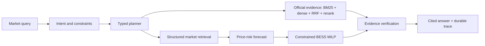

# Australian Energy Market Intelligence Agent

An evidence-first Agentic AI system for the Australian National Electricity Market (NEM): five-minute price-event detection, official-evidence retrieval, price-risk forecasting, constrained battery dispatch, historical value backtesting and auditable answers.

> **Verified release candidate — 21 August 2026.** The repository has a complete two-year/five-region AEMO dataset, official AEMO/AER evidence index, rolling forecast and BESS experiments, a 100-task Agent evaluation, passage-support and untrusted-evidence gates, and an isolated Alibaba Cloud deployment. Model Studio was not configured, so the verified service uses deterministic typed planning; the constrained OpenAI-compatible adapter is tested offline but no live-model result or cost is claimed.

## System



The eight strict Pydantic tools are `get_market_snapshot`, `compare_region_period`, `detect_price_events`, `diagnose_price_event`, `search_official_evidence`, `forecast_price_risk`, `optimize_battery_dispatch`, and `explain_data_coverage`. User-supplied SQL, Elasticsearch DSL and optimisation expressions are rejected. The state machine performs normalization, bounded parallel calls, timeout/retry with backoff, loop detection, empty-result recovery, evidence/calculation verification and concise synthesis; complete tool outputs remain in the trace.

API: `POST /api/agent/query`, `GET /api/agent/traces/{trace_id}`, `GET /api/tools`, `GET /metrics`, and `GET /healthz`.

## Data and evidence provenance

- Market data: official [AEMO NEMWeb](https://nemweb.com.au/) DispatchIS plus monthly MMSDM archives, 18 August 2024–17 August 2026, 730 days × 288 intervals × five regions = **1,051,200 standard rows**.
- Fields: RRP, total demand, available generation, net interchange and intervention. The validated window contains no intervention rows.
- The daily archive for 10 March 2026 was incomplete. A v1 repair exposed a settlement-time bug: five duplicated midnight keys and one 10-minute gap per region. The v2 pipeline assigns each interval-ending timestamp to its preceding five-minute dispatch day, fails closed on global duplicate/gap checks, and replaces the affected official day from monthly `DISPATCHPRICE` and `DISPATCHREGIONSUM` only—no interpolation or synthetic fill.
- Corrected current-year SHA-256: `9025d32d...209567`; earlier-year SHA-256: `d82826a2...656da`; contiguous two-year SHA-256: `e06384b6...60795`. Duplicate keys and five-minute gaps are both **zero**.
- Explanatory corpus: four AEMO Quarterly Energy Dynamics reports (Q3 2025–Q2 2026) and the AER January–March 2026 significant-price report; **735 chunks** with URL, publication/retrieval times, source hash, size, page count and usage boundary.
- Large artifacts and report text stay outside GitHub. Only compact, non-sensitive manifests and metrics are published under `artifacts/public/`; AEMO/AER source rights and terms remain with their publishers.

## Experiments

Implementation choices are tied to sampled Australian hiring signals and primary
research in [the paper-to-hiring map](docs/PAPER_TO_HIRING.md). Paper names are
not treated as accomplishments: the map distinguishes method-inspired code,
verified evaluation and work that remains outside the evidence gate.

The corrected headline evaluation uses eight independent 28-day region-season folds over the two contiguous years, each with a preceding 28-day calibration window and at least 30 earlier training days. No future labels enter features, calibration windows or operational schedules. Older one-year v1 artifacts remain regression diagnostics only and are not the current evidence source.

### Retrieval

On the original 20-query curated official-source routing benchmark, BM25 reached MRR 0.892 and Recall@5 1.00; the revised hybrid rerank reached **MRR 1.00, Recall@5 1.00** without a routing regression. A separate 20-claim exact-support set over the same five official reports exposed a different failure: dense-only passage retrieval reached just MRR 0.214/Recall@5 0.50 and unweighted RRF reached 0.521/0.70. Adding auditable lexical-strength, query-term and numeric-preservation features raised hybrid passage retrieval to **MRR 0.800, Recall@5 1.00** (bootstrap MRR 95% interval 0.70–0.90); BM25 remained the stronger top-rank baseline at MRR 0.875. The passage labels are author-curated, not independent blind annotation or an LLM semantic-entailment judge. See the [exact-SHA gate artifact](artifacts/public/evidence_security_gate_20260821.json).

### Forecast and anomaly stability

- Baselines: persistence and 24-hour seasonal; candidate: LightGBM L1 plus quantile models.
- LightGBM did **not** consistently beat persistence on MAE. In the stronger four-season evaluation it won only **9 of 20 region-season folds**, so no universal prediction-lift claim is made.
- Seasonal 90% conformal coverage ranged from **79.74% to 96.21%** across 20 folds; the 79.74% TAS1 winter result is retained as evidence of distribution shift rather than hidden by an aggregate. The earlier terminal-split rolling coverage range was 88.64%–91.52%.
- An ACI-inspired online controller narrowed the five-region coverage range to **89.81%–90.31%** and reduced mean absolute nominal-coverage gap from 2.74 to 0.08 percentage points. It narrowed intervals in only 12/20 folds, however, and TAS1 winter width increased **10.07x**; coverage stability is therefore not presented as uniformly better operational uncertainty.
- Anomaly reporting compares a fixed `RRP >= AUD 5,000/MWh` baseline with robust-z thresholds 4/5/6, Jaccard stability and day-level bootstrap event-rate intervals. There is no labelled anomaly ground truth, so counts are not presented as precision/recall.

### BESS backtest

The standard battery is 1 MW / 2 MWh, 90% round-trip efficiency, 10–90% SoC, and 50% initial/terminal SoC. The MILP prevents simultaneous charge/discharge. Both the MILP and threshold baseline receive the same leakage-free LightGBM price signal; actual prices are used only for settlement, while the oracle alone receives perfect foresight.

The corrected two-year transport gate covers **224 out-of-time days per region, 1,120 region-days overall** at the predeclared 50 AUD/MWh discharged-energy cost. LightGBM won point MAE in only **15/40** folds but its forecast-driven MILP beat the threshold-rule dispatch in **39/40**. All five regions had positive annualised net-operating proxies; the five-region mean was **AUD 84,792/MW-year** versus **AUD 23,279/MW-year** for the rule baseline (3.64x). The mean per-fold improvement was AUD 4,718.80 with a paired-bootstrap 95% interval of **AUD 3,079.62–6,912.10**. Mean equivalent full cycles were 234.94, mean oracle capture was 57.08%, and mean positive-day share was 90.71%. The predeclared 60%-fold/4-region gate passed. See the [compact exact-SHA artifact](artifacts/public/historical_transport_gate_20260821.json).

These are **historical spot-market operating-margin proxy metrics only**. The cycling charge is a user-supplied sensitivity parameter, not an asset-specific degradation model; results still exclude CAPEX, fixed O&M, network fees, FCAS, bidding/settlement complexity and any claim of investment return.

Decision-focused evaluation exposed why MAE is not the release metric: on the corrected two-year gate, MAE won only 37.5% of folds while realised dispatch value won 97.5%. Lower tails remain material—the regional daily CVaR05 range is **-155.05 to -8.36 AUD**—so the positive mean is not presented without downside evidence.

The corrected two-year risk gate then aggregated the already-settled nested scenario-CVaR policy across the same 40 folds. Seven folds selected non-point risk aversion. Mean annualised operating proxy rose from **AUD 84,792 to 86,191/MW-year (+1.65%)**, but mean fold-level CVaR05 worsened by **AUD 3.62** with a 95% paired-bootstrap interval of **-10.60 to -0.003 AUD**; only **1/5** regions improved aggregate CVaR05 and TAS1 retained only **88.18%** of point value. The predeclared tail-and-mean promotion gate therefore failed. This is a useful scenario-transport stop result, not a positive risk claim; see the [exact-SHA artifact](artifacts/public/risk_transport_gate_20260821.json).

The following CVaR, optimiser-weighting and ensemble experiments were run on the superseded one-year v1 time axis. They remain reproducible methodological/negative ablations, but their numeric outcomes are not combined with the corrected v2 headline and do not enter resume claims. A nested calibration gate selected point dispatch in 17/20 folds and CVaR candidates in three; all three selected candidates were worse on unseen realised tail margin. See the compact [paper-driven artifact](artifacts/public/paper_driven_evaluation_20260821.json).

An additional SA1 pilot used training-only perfect-foresight optimiser actions to up-weight charge/discharge intervals in the LightGBM L1 loss. The raw weighted candidate increased the 112-day net proxy by **AUD 180.20** (annualised **AUD 53,319.81 vs 52,732.55/MW-year**) but worsened daily CVaR05 from **-9.36 to -12.45 AUD**. A pre-test mean-plus-tail calibration gate therefore selected the baseline in all four seasonal folds, giving zero selected-policy lift. The raw weighted model was not expanded directly. This is an optimiser-informed loss-proxy negative gate, not SPO+ or a claimed improvement; see the [compact pilot artifact](artifacts/public/decision_weighted_sa1_gate_20260821.json).

A follow-up fixed-grid ensemble used only each fold's preceding calibration window to choose weight 0/0.25/0.5/0.75/1.0, with a tail floor declared before the five-region run. SA1 alone improved from **AUD 52,732.55 to 53,626.36/MW-year**, but the exact-SHA 560-region-day gate rejected promotion: the five-region mean fell from **AUD 41,048.15 to 39,595.59/MW-year (-3.54%)**, only **2/5** regions improved versus a required 3/5, and the paired region-season mean-delta 95% bootstrap interval was **-366.73 to 31.39 AUD**. All regional tail floors passed, but `promotion_pass=false`; the SA1 result is not promoted as economic lift. See the [cross-region stop artifact](artifacts/public/dispatch_ensemble_gate_20260821.json).

The v1 exact-SHA five-region reproduction also evaluated the full predeclared
`0/25/50/100 AUD/MWh` cost grid. Its normalised `50 AUD/MWh` projection is
byte-for-byte identical to the published decision run
(`sha256=233364c4...51b7`); the complete all-cost metrics hash is
`7dd896ea...7d3`. It is retained as a superseded reproducibility result, not another model gain or current economic evidence.

### Agent evaluation

The fixed suite has 80 real-window tasks plus 20 separately reported transient error/empty/timeout fixtures, comparing no-tools, single-tool and the full state machine. The full state machine completed **100/100 tasks** with 100% schema validity, citation completeness, logical-tool success and injected-failure recovery. Real-window raw attempt success was 100%; fault-fixture raw attempt success was 66.7% by construction because each fixture injects one failed attempt before recovery. Offline P95 latency was 644 ms and is not a public-network SLA.

An additional indirect-prompt-injection regression contains **24 attacks across eight families plus eight benign controls**, each repeated five times (160 trials; 120 attack trials). The deterministic typed plan was preserved in 120/120 attack trials, with zero unregistered tool actions, zero marker leakage and 40/40 benign-control successes. With zero observed unsafe actions, the two-sided Wilson 95% upper bound is still 3.10%; this is an architecture-bound regression because retrieved text never enters the deterministic planner, not a live-model robustness benchmark or an AgentDojo score.

## Deployment

The isolated Alibaba Cloud SG Compose stack runs FastAPI, Elasticsearch 8.19, Redis 7.4 and Prometheus 3.5 with loopback-only host bindings and explicit CPU/RAM limits. Elasticsearch now holds a versioned, strict-mapping index behind the `energy-official-evidence` alias (**735/735 chunks**); the service executes a fixed `multi_match` BM25 query, source-diversifies candidates, and fuses them with local BM25/dense retrieval, RRF and deterministic reranking. Users can never submit Elasticsearch DSL. Indexing/count failures fail over to the local hybrid path and are exposed in `/healthz` instead of being reported as indexed success. On the same 20-query source-routing set, deployed ES BM25 reached MRR **0.858**/Recall@5 **1.00** while the fused path retained **0.967/1.00**; ES BM25 alone is not claimed to improve ranking quality.

`/metrics` exports request status, latency buckets, typed-tool status/recovery, citation totals, provider/backend identity, loaded row/chunk gauges and trace-cache occupancy/evictions. Full traces are retained in an in-process LRU capped at 128 entries and persisted to Redis for 24 hours; eviction never makes Redis-backed trace retrieval unavailable. A post-deployment gate over **140 real-data loopback requests** (five regions × coverage/event/forecast/BESS, concurrency 4) achieved 140/140 HTTP, task, citation and raw-tool success; P50/P95/max latency was **446/1,911/2,444 ms**. The cache ended at 128 entries with 12 expected evictions, and an early evicted trace remained retrievable through Redis. This is a bounded single-host loopback service check, not a public-network SLA or an independent answer-quality benchmark.

Prometheus evaluates five local rules for target availability, insufficient-evidence ratio, typed-tool failure ratio, P95 latency and rapid trace turnover. Rules are validated with Prometheus 3.5 `promtool`; no Alertmanager or external notification channel is configured.

The optional Model Studio planner follows Alibaba Cloud's [OpenAI-compatible endpoint contract](https://help.aliyun.com/zh/model-studio/compatibility-of-openai-with-dashscope). It reads `MODEL_STUDIO_BASE_URL`, `MODEL_STUDIO_MODEL` and `DASHSCOPE_API_KEY` only from the environment, requires HTTPS, and validates every returned tool name/argument against the registered Pydantic schemas. Credentials were absent during verification, so live-model behavior and cost remain unverified.

## Reproduce

Quality gates:

```bash
python -m venv .venv
. .venv/bin/activate
pip install -e ".[test,ml,search,redis]"
pytest
ruff check .
mypy src scripts
python -m pip_audit --skip-editable
```

Real-data workflow (downloads official public data and can take several minutes):

```bash
python scripts/ingest_dispatch_year.py --start 2025-08-18 --end 2026-08-17 --output artifacts/run
python scripts/validate_dispatch_coverage.py --data artifacts/run/dispatch_features.csv.gz --manifest artifacts/run/run_manifest.json
# If the validator identifies the known official gap, repair only from monthly AEMO MMSDM:
python scripts/repair_dispatch_gap.py --input artifacts/run/dispatch_features.csv.gz --output artifacts/run/dispatch_features_repaired.csv.gz --day 2026-03-10
python scripts/build_official_evidence.py --output artifacts/evidence
python scripts/evaluate_retrieval.py --evidence artifacts/evidence/evidence_documents.jsonl --output artifacts/retrieval-eval
python scripts/evaluate_passage_support.py --evidence artifacts/evidence/evidence_documents.jsonl --output artifacts/passage-support --fail-on-gate
python scripts/evaluate_agent_security.py --output artifacts/security-eval --repetitions 5 --fail-on-gate
python scripts/evaluate_real_market.py --input artifacts/run/dispatch_features_repaired.csv.gz --output artifacts/real-eval
python scripts/evaluate_real_market.py --input artifacts/run/dispatch_features_repaired.csv.gz --output artifacts/seasonal-eval --seasonal-bess --degradation-costs 0,25,50,100
python scripts/evaluate_agent_real.py --data artifacts/run/dispatch_features_repaired.csv.gz --data-manifest artifacts/run/final_manifest.json --evidence artifacts/evidence/evidence_documents.jsonl --output artifacts/agent-eval
# Optional deployed-backend routing regression and bounded loopback service gate:
python scripts/evaluate_retrieval.py --evidence artifacts/evidence/evidence_documents.jsonl --output artifacts/retrieval-es --elasticsearch-url http://127.0.0.1:9200
python scripts/evaluate_service.py --base-url http://127.0.0.1:8091 --output artifacts/service-eval.json --fail-on-gate
```

To start the restricted service, place the three generated files in `deploy-data/` as `dispatch_features_repaired.csv.gz`, `final_manifest.json` and `evidence_documents.jsonl`, then run:

```bash
docker compose up -d --build
curl http://127.0.0.1:8091/healthz
```

Spartan scripts use short preflight/pilot jobs, `sbatch --test-only`, measured resource requests and `afterok` chains. Each evaluation creates a job-local `/tmp` environment and removes it on exit.

## Error cases and boundaries

- Official daily coverage can be incomplete; validation is fail-closed and repairs require a hashed official alternative source.
- LightGBM is not consistently superior to persistence; the negative result remains visible.
- Seasonal conformal coverage falls to 79.74% for TAS1 winter; aggregate calibration must not hide this distribution-shift failure.
- Source-routing and author-curated exact-support labels are reported separately; neither is an independent answer-entailment study. Anomaly labels are unavailable, and diagnostic associations are not causal attribution.
- Elasticsearch is an actual fixed-query retrieval backend, but was observed near its 1 GiB container limit; production sizing still requires more headroom.
- Model Studio live planning is blocked only by absent workspace endpoint/API credentials; deterministic planning and all non-model chains are complete.
- Retrieved report text is treated as untrusted data: 24 attacks across eight families and eight benign controls verify the deterministic planner/data boundary over 160 repeated fixture trials. This is not a live-model benchmark, an AgentDojo score or a general robustness claim.
- Slurm evaluation code and manifest SHAs are pinned to the same detached, job-local Git worktree. A legacy queued chain that observed a changing shared checkout was rejected at the provenance gate; its completed metrics are not published as a verified experiment.
- Nested CVaR selection did not generalise: the three non-point selections passed a 14-day calibration slice but worsened unseen realised tail margin. The implementation remains tested, while the positive risk-improvement claim is rejected.
- Optimiser-action weighting produced a small raw SA1 mean-margin gain but worse tail performance; a subsequent calibration-selected convex ensemble also failed its predeclared five-region promotion gate (2/5 positive, aggregate -3.54%), so no positive gain claim is made.

## Attribution

The generalized typed-tool/state-machine pattern is a new personal portfolio extension derived from lessons in the author's housing Agent project. The Team 12 housing history remains attributed to that team. No housing code, data, artifacts, restricted corpora or team outcomes are included here; energy schemas, ingestion, evidence retrieval, forecasting, optimisation, evaluation, deployment and documentation are independent work.

## License

MIT for repository code. AEMO/AER data and reports retain their source terms and are not relicensed by this repository.
