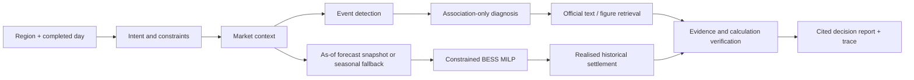

# Australian Energy Market Intelligence Agent

An evidence-first **historical decision-replay Agent** for Australian National Electricity Market (NEM) analysts and battery strategy teams.

Given a region and a completed market day, the Agent reconstructs what was knowable at the time, detects price events, retrieves official AEMO/AER text and figure evidence, creates a leakage-safe price-risk forecast, solves a constrained 1 MW / 2 MWh BESS schedule, settles that fixed schedule on realised historical prices, and returns an auditable decision report.

It is not a live trading, automatic bidding or investment-return system.

## One flagship question

> What happened in SA1 on 15 December 2025, what official report and chart evidence supports the explanation, and how would a 1 MW / 2 MWh BESS have dispatched using only information available beforehand?

The answer separates five things that are often blurred in portfolio projects:

1. observed market context;
2. explanatory official evidence;
3. an as-of forecast and uncertainty interval;
4. a physically feasible schedule planned on that forecast;
5. realised historical settlement after the schedule is fixed.

Every claim retains evidence IDs, official URLs, source/page or figure identity, hashes, tool arguments, data version, recovery attempts and calculation boundaries in the trace.

## Online decision-replay path



The control plane is a bounded DAG rather than free-form ReAct. It supports dependent stages, typed inputs, at most one alternate-modality recovery, timeout backoff, duplicate suppression, progress/stall recording and fail-closed verification. A configured Model Studio planner may propose only registered calls; without credentials, the deterministic DAG remains the verified path.

The eight Pydantic tools are unchanged: `get_market_snapshot`, `compare_region_period`, `detect_price_events`, `diagnose_price_event`, `search_official_evidence`, `forecast_price_risk`, `optimize_battery_dispatch`, and `explain_data_coverage`. Users cannot submit SQL, Elasticsearch DSL, file paths or optimisation expressions.

## Data and evidence planes

**Structured market data.** The current offline evidence covers official AEMO DispatchIS/monthly MMSDM data from 18 August 2024 to 17 August 2026: 730 days × 288 five-minute intervals × five NEM regions = **1,051,200 rows**. The corrected timeline has zero duplicate region/timestamp keys and zero five-minute gaps. One incomplete daily archive was replaced only from the official monthly tables; no interpolation or synthetic market fill was used.

**Official text.** Six AEMO/AER reports compile to **905 provenance-bearing chunks**. Elasticsearch provides fixed-query BM25; local BM25, 64-D LSA, RRF and deterministic numeric/lexical reranking provide the bounded hybrid path. The deployed SG index is versioned behind an alias and can roll back to the prior release.

**Official figures.** A lightweight serving route reads precompiled QED workbook figure records containing figure identity, image hashes and bounded previews of the underlying source cells. A source-disjoint Q1 2026 holdout reached **MRR 0.9667 / Recall@5 1.00**, versus text-chunk MRR 0.7308, on 20 author-curated queries. This proves figure routing and source-cell provenance, not VLM reasoning or answer correctness.

**Optional visual research.** Qwen3-VL-Embedding-2B page retrieval remains an offline Spartan adapter. It is not loaded into the small SG API. Its positive transport and negative fusion experiments are retained in the [experiment catalogue](docs/EXPERIMENT_CATALOG.md), not presented as the online product path.

## Three verified results that matter

1. **Decision-aware release gate.** In the corrected two-year evaluation, LightGBM won MAE in only **15/40** region-season folds but its forecast-driven BESS schedule beat the threshold rule in **39/40** folds. This is why model promotion uses realised decision value as well as prediction error.
2. **Bounded historical value.** At a fixed user-supplied 50 AUD/MWh discharged-energy cost, the five-region historical operating proxy averaged **AUD 84,792 versus 23,279/MW-year** for the threshold rule. The paired-fold mean-delta interval was AUD 3,079.62–6,912.10. These are five separate hypothetical batteries and not investment returns.
3. **Unified Agent gate and deployment.** Exact-commit Spartan evaluation passed **60/60 real-window cases and 20/20 fault cases**; tool, citation, figure and BESS golden rates were 100%, with P95 512 ms. The loopback-only Alibaba Cloud Singapore stack then loaded 905 text chunks, 130 workbook figures and 15 versioned forecast snapshots and passed **100/100** HTTP/trace/figure/snapshot/settlement checks at P95 789 ms.

## Local demo

The package serves a dependency-free interface at `/` with three bounded cases, DAG progress, forecast and SoC plots, official citations, planned versus realised margin, verification results and the full trace.

```powershell
python -m venv .venv
.venv\Scripts\python -m pip install -e ".[test,ml,search,redis,workbook]"
.venv\Scripts\python -m uvicorn energy_agent.api:app --host 127.0.0.1 --port 8080
```

Open `http://127.0.0.1:8080`. Without private data mounts the service intentionally uses a labelled synthetic fixture for contract testing.

The API remains stable: `POST /api/agent/query`, `GET /api/agent/traces/{trace_id}`, `GET /api/tools`, `GET /healthz`, and `GET /metrics`.

`AgentQueryResponse` retains `answer`, `citations`, `tool_calls` and `trace_id`, and adds structured `workflow_type`, `decision_summary`, `market_context`, `forecast`, `dispatch`, `historical_settlement`, `verification` and `limitations` fields.

## Reproduce and evaluate

```powershell
.venv\Scripts\python -m pytest
.venv\Scripts\python -m ruff check src tests scripts
.venv\Scripts\python -m mypy src scripts
```

The unified evaluation declares **60 real-window decision tasks**—15 each for event diagnosis, region comparison, figure grounding and BESS replay—plus **20 separately scored fault tasks**. All 80 passed on the final 905-chunk exact-commit run; schema and BESS golden checks, citation provenance, figure grounding, tool/task success and fault handling were 100%, at P95 512 ms. Real data, report-derived records and row-level predictions stay outside GitHub; the compact [public gate](artifacts/public/decision_replay_gate_20260825.json) retains metrics, job IDs and exact hashes.

Heavy backfills and evaluation run on Spartan through short preflight/test-only jobs and exact-commit Slurm execution. The SG service consumes only versioned published artifacts; it does not train LightGBM or run a 2B visual encoder inside an API request.

## Boundaries

- Historical replay is not live forecasting, trading, bidding, dispatch instruction or market advice.
- `planned_margin_aud` is calculated on the forecast signal. `realized_margin_aud` exists only for a completed window with full actual coverage and is labelled historical settlement.
- The BESS value is a historical spot-market operating proxy. It excludes CAPEX, fixed O&M, network charges, FCAS, taxes, financing, full degradation modelling and investment return.
- Official-report labels are author-curated unless explicitly stated; citation structure and retrieval relevance do not prove semantic entailment.
- The deterministic planner evaluation proves tool contracts and recovery, not open-ended LLM reasoning accuracy.
- Negative and superseded experiments remain public and are classified rather than deleted.

See the [decision-replay case study](docs/CASE_STUDY.md), [system card](docs/SYSTEM_CARD.md), [experiment catalogue](docs/EXPERIMENT_CATALOG.md), and [interview defence map](docs/INTERVIEW.md).

## Attribution and license

This repository is an independent project. It generalises only the author's own typed-tool/state-machine work and does not copy housing-project data, team artifacts or restricted corpora. AEMO/AER source rights remain with their publishers. Code is released under the [MIT License](LICENSE).
