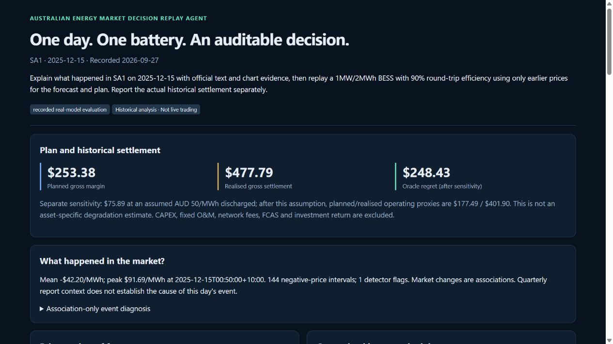
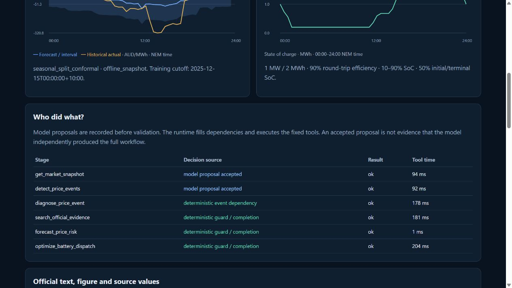

# One historical decision replay — interview demonstration

The deliverable is a self-contained, recorded-run HTML page and compact JSON.
It requires no live GPU, public API, browser key or cloud service. The recording
labels the exact execution mode: deterministic baseline or real-model evaluation.
The real-model recording is now available from job `31365444`, code `7232306`:
[open/download the self-contained page](demos/model-replay-20260927/index.html),
[compact response](demos/model-replay-20260927/recorded_run.json),
and [hash-bound manifest](../artifacts/public/p1_recorded_replay_manifest_20260927.json).
Open the HTML locally, or run `python -m http.server 8097 --bind 127.0.0.1
--directory docs/demos/model-replay-20260927`. No private mounts or live model are
needed to view this recording. Re-running inference still requires the inputs
and allocated runtime described below.

The case passed 13 export checks. Qwen's snapshot and event proposals were
accepted; retrieval, forecast and dispatch were replaced by typed runtime guards,
and event diagnosis was a runtime dependency. Its 2,423/510 prompt/completion
tokens and 18.38 s elapsed time describe one sample, not a percentile or SLA.
The full new holdout remains separate; this case does not promote the planner.





## Reproduce on an allocated Spartan compute node

Install the repository with `pip install '.[test,search,workbook]'`. Set `ROOT`
to the private Energy artifact root. Never run this calculation on a login node.

```bash
python scripts/export_interview_demo.py \
  --data "$ROOT/ingest-12m/dispatch_features_repaired_v2.csv.gz" \
  --data-manifest "$ROOT/ingest-12m/final_manifest_v2.json" \
  --evidence "$ROOT/claim-transport-input-905/evidence_documents.jsonl" \
  --figures "$FIGURES" \
  --forecast-snapshots "$ROOT/forecast-snapshots-c66e415.jsonl" \
  --output "$ROOT/planner-remediation-20260927/preview/my-recorded-run" \
  --private-output "$ROOT/planner-remediation-20260927/private/my-recorded-run"
```

That command intentionally produces a deterministic baseline. Add
`--provider-url http://127.0.0.1:11627/v1 --model Qwen3-8B-Q4_K_M.gguf --seed 17`
only inside an allocation running the verified loopback model. The full private
tool trace stays in the private output directory; publish only the inspected
compact response, HTML, screenshot and hashes. A failed gate does not write a
successful demo. Output paths must be new, preventing silent replacement of runs.

Before export, compile the Q4 2025 official workbook on the allocated compute node
with `python scripts/compile_demo_workbook.py --output NEW_PRIVATE_WORKBOOK_DIR`,
and set `FIGURES` to its `figure_manifest.jsonl`. The source URL and publication
date are taken from AEMO's official QED catalogue. Compilation records the source
and derived hashes without publishing the raw workbook. Q1 2026 figures are not
substitutes for Q4 2025 context. Topic, region and report-quarter screening is a
conservative filter, not an entailment classifier or day-specific causal proof.

Open the generated `index.html` directly or serve its directory locally:

```bash
python -m http.server 8097 --bind 127.0.0.1 --directory PATH_TO_RECORDED_DEMO
```

## Two-minute narration

“这个项目服务能源分析师和电池策略人员，回答的是一个历史决策问题：某天市场发生了什么，
如果当时使用这些价格信息安排电池，实际历史结算会怎样。

先看页面顶部。它标明这是录制的真实历史回放，固定区域、日期、数据版本和模型版本。
页面中间把预测信号与事后实际价格分开画出。预测只读取决策时间之前的数据；这里具体
使用的模型由页面元数据决定，不能把离线 LightGBM 实验直接当成这一次查询使用的模型。

接着看 who did what。真实模型版本会保存第一次工具提议，确定性 runtime 校验参数，
补齐依赖并执行。我把模型提议、补全后的计划、最后执行的结果分开，避免把 runtime
兜底后的正确结果写成模型自主规划能力。模型也不能把 forecast 改成使用真实未来价格
的 perfect-foresight oracle。

下面是官方文本、workbook 图表和源值预览。报告可以在事件之后发表，所以它们明确
标为回溯解释；它们不进入预测和优化目标，也不构成该天事件的因果证明。

最后看结算。电池受功率、容量、效率和初末 SoC 约束，计划固定后才用真实价格结算。
导出器另写一遍现金流与 SoC 方程进行独立核算，展示毛结算和扣除假设循环成本后的
运营代理，明确不包含 CAPEX、网络费用、FCAS 或投资回报。

我的关键判断是：用模型理解需求，用确定性工具承担可验证的计算，再用独立任务评测
判断模型是否值得采用。一次演示成功不替代冻结评测，失败实验也保留。”

## Interview STAR and resume boundary

Situation: the original demonstration obscured whether a failure came from model
planning, state reconstruction, missing market data or evaluation definitions.
Task: make one replay understandable and make planner measurements attributable.
Action: diagnose the old pilot; apply sourced constraints without reparsing
corrections; separate first proposals, guarded calls and execution; reject oracle
substitution; verify input hashes and recompute battery settlement; label report
publication precision. Result: a real-model SA1 recording passed 13 independent
export checks, with two model-accepted stages and four explicitly runtime-owned
stages. The independent GoalSpec development experiment still achieved 0/8 task
success and was not promoted. Full planner accuracy must come from the completed
frozen holdout, not this demonstration or development pilot.

At most two candidate statements, pending completion evidence and career review:

1. 构建历史能源决策回放 Agent，将真实 NEM 数据、官方文本/图表、as-of 价格预测和受约束
   BESS 调度串成可追溯流程，独立复核完整电池约束与历史结算，提供可离线演示的决策报告。
2. 为真实 8B 工具规划建立带来源状态和三层归因评测，区分模型首轮提议、确定性补全与
   最终执行，定位跨轮纠正和数据窗口失配，并以冻结的新任务验证；未通过门槛的模型保留为负实验。

These are candidates only. No current resume or shared career material is edited.
